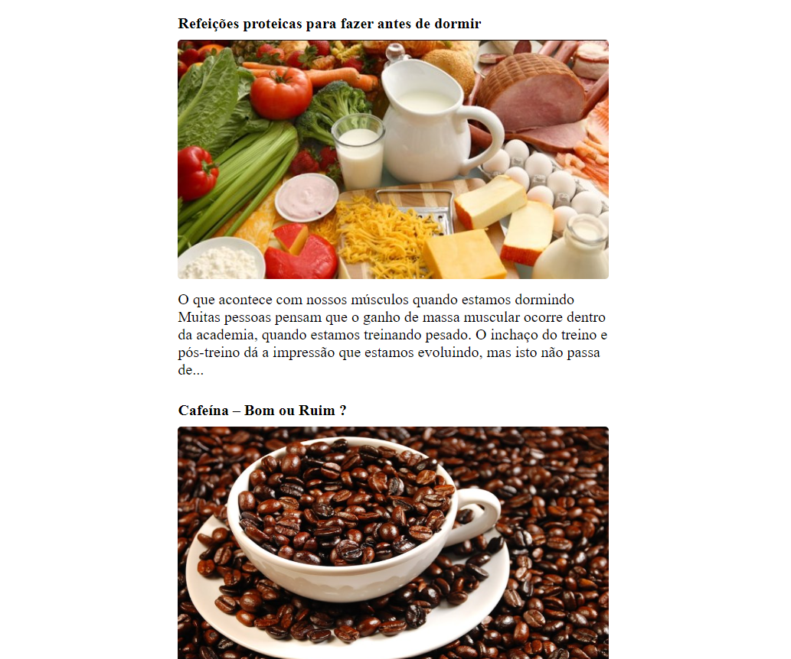

<h1 align="center"> Requisição http - Consumindo API Externa </h1>

Programa desenvolvido durante os estudos do curso Fabrica de Aplicativos - Sujeito Programador. 

  <a href="#-tecnologias">Tecnologias</a>     |    
  <a href="#-projeto">Projeto</a>     |    
  <a href="#-licença">Licença</a>

  

 

  

## 🚀 Tecnologias

Esse projeto foi desenvolvido com as seguintes tecnologias:

- HTML e CSS
- JavaScript
- Git e Github
- Visual Studio Code

## 💻 Projeto

O projeto Requisição http é uma página web que consome uma API Externa e é mostrado as informações contidas nessa API na tela do navegador. A API Externa está disponível [aqui](https://sujeitoprogramador.com/rn-api/?api=posts).

- [ Visite o projeto online ](https://lipeharakawa.github.io/f_a_requisi-o_http-html-css-js)

## ✅ Licença

Esse projeto está sob a licença MIT.

---

Feito com 🧡 por Felipe Seidi Harakawa, durante o curso Fabrica de Aplicativos - Sujeito Programador. [ Visite o site! ](https://sujeitoprogramador.com/fabricadeaplicativos)
